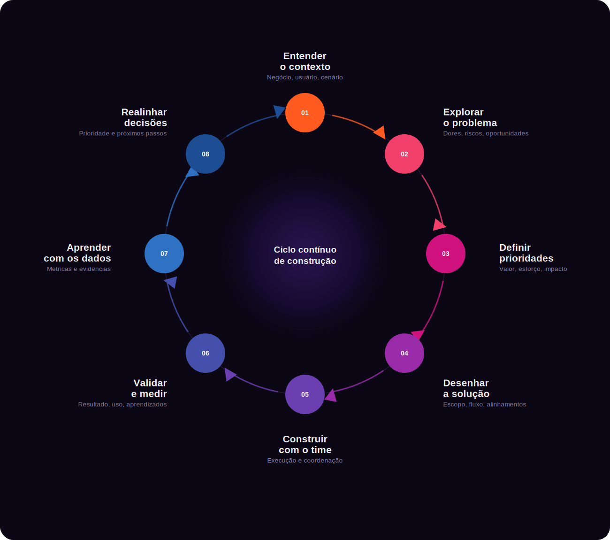

<h1 align="center">Oi, eu sou a Bia :)</h1>

  Produto • Projetos • Gestão de Software

 

Trabalho com Produto, Projetos e Gestão de Software desde 2020, em ambientes onde negócio, tecnologia e operação precisam caminhar juntos.

Já atuei como Product Manager, Product Owner, Analista de Produto, PMO e Coordenadora de Operações e Produto. Essa trajetória me deu uma visão ampla do ciclo de vida de produtos digitais, do discovery ao go live, com foco em evolução contínua, métricas e geração de valor para o negócio.

---

### Onde estratégia encontra execução

Não vejo produto como uma sequência linear de documentos e entregas. Para mim, construir produtos é um processo contínuo de investigação, escolhas, colaboração, aprendizado e evolução.

O que se aprende durante a execução realimenta a leitura do contexto e orienta as próximas decisões.

  

---

  <strong>A cultura digital é cultura.</strong>

